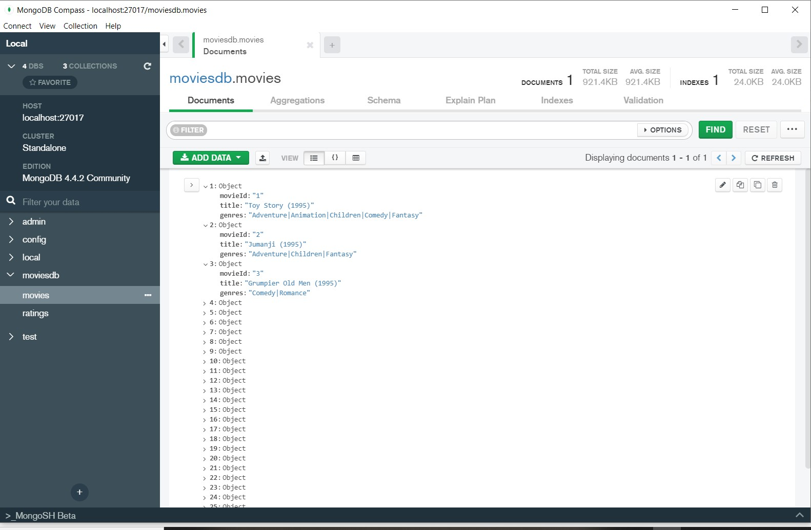
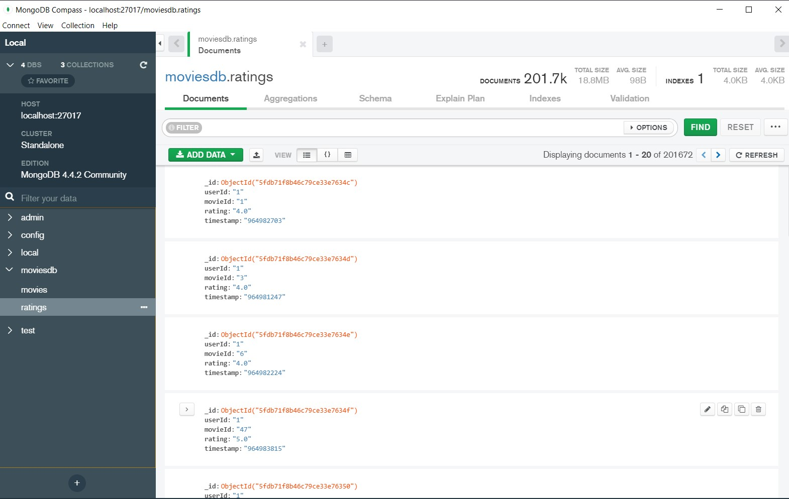

# Spinoff3moviesMongodb

## Client: Société Floupics 
    
    
### Contexte du projet

La Startup dans laquelle vous travaillez souhaiterait présenter une évolution intéressante et être force de proposition. En revanche, comme elle n'est pas riche et en même temps vous faites partie de la communauté Open Source Soldat (OSS42) et Ninja, elle souhaite de votre part que vous lui présentiez un POC sur cette base :

## MONGODB

https://www.mongodb.com/

MongoDB est un système de gestion de base de données, universelle, distribuée (répartissable sur un nombre quelconque d'ordinateurs), basé sur les documents et ne nécessitant pas de schéma prédéfini des données. Il est écrit en C++.

MongoDB permet de manipuler des objets structurés au format BSON (JSON binaire), sans schéma prédéterminé. En d'autres termes, des clés peuvent être ajoutées à tout moment « à la volée », sans reconfiguration de la base.

Les données prennent la forme de documents enregistrés eux-mêmes dans des collections, une collection contenant un nombre quelconque de documents. Les collections sont comparables aux tables, et les documents aux enregistrements des bases de données relationnelles. Contrairement aux bases de données relationnelles, les champs d'un enregistrement sont libres et peuvent être différents d'un enregistrement à un autre au sein d'une même collection. Le seul champ commun et obligatoire est le champ de clé principale ("id"). Par ailleurs, MongoDB ne permet ni les requêtes très complexes standardisées, ni les JOIN.

   1) installation et mise en place de MongoDB Community Edition en local
   
   - lien de téléchargement et instruction d'installation dans le lien suivant:
   https://docs.mongodb.com/manual/tutorial/install-mongodb-on-windows/#install-mongodb-community-edition
   
   - Nous devons créer un dossier data à la racine (C:), à l'intérieur duquel nous mettrons un dossier db pour y stocker nos futurs base de données.
   
   - Pour lancer MongoDB, il faut ouvrir un CLI en mode Administrateur et taper la commande:
    > "C:\Program Files\MongoDB\Server\4.4\bin\mongod.exe" --dbpath="c:\data\db"
   
   2) création d'une collection Movies et de documents à partir du CSV Movies small avec Python3
  
  ==> Voir le fichier spinoff3.ipynb
   
   
   3) visualisation parlante suite aux scripts python et aussi sur MongoDB Compass
   
MongoDB Compass est une interface graphique qui nous permet de visualiser les données.
Avant de pouvoir l'utiliser, il faut absolument que MonogoDB soit lancer
Exemple avec la collection movies:

Autre exemple avec la collection ratings:

### Ressources externes:

Ressources:
    - https://docs.mongodb.com/guides/
    - https://www.youtube.com/watch?v=rE_bJl2GAY8&t
    - https://www.youtube.com/watch?v=YbLzV90dksE
    - https://www.youtube.com/watch?v=pWbMrx5rVBE&t
    - https://medium.com/@hannah15198/convert-csv-to-json-with-python-b8899c722f6d
    - https://www.youtube.com/watch?v=La6ZO8vu-1w&t=347s
    - https://stackoverflow.com/questions/62072355/how-to-import-csv-file-into-mongodb-using-python
    - https://openclassrooms.com/fr/courses/4462426-maitrisez-les-bases-de-donnees-nosql/4474601-decouvrez-le-fonctionnement-de-mongodb
    